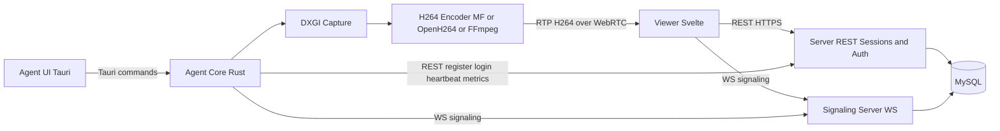
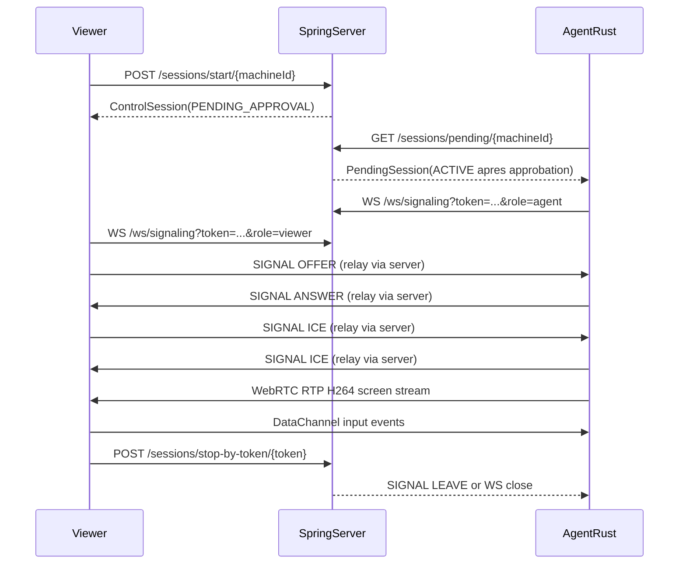

# Rapport PFE detaille - Remote IT Support

## 1. Contexte et problematique

Le projet vise a fournir une solution de prise en main distante pour support informatique, avec:
- un agent desktop execute sur la machine assistee (capture ecran, telemetrie, reception des commandes),
- un viewer cote technicien (interface session/chat/controle),
- un serveur central (authentification, orchestration des sessions, signaling WebRTC, persistance).

L'objectif technique principal est de proposer une base native performante sous Windows pour le streaming ecran, tout en gardant une architecture modulaire et extensible.

## 2. Objectifs du PFE

Objectifs fonctionnels:
- Permettre l'ouverture de sessions de controle a distance entre technicien et agent.
- Gerer approbation/rejet de session avec permissions explicites.
- Assurer streaming ecran, chat, et transfert de fichiers.

Objectifs techniques:
- Mettre en place un pipeline video natif (DXGI Desktop Duplication).
- Integrer un backend H.264 natif Windows (Media Foundation) avec fallback.
- Maintenir un fonctionnement stable du signaling/WebRTC et de la supervision (metrics, heartbeat).

## 3. Perimetre analyse

- Client desktop et viewer: `C:/Users/NTS/Desktop/lumiere/lumiere-tech-it`
  - Backend Tauri/Rust: `src-tauri/src/agent/*`
  - Frontend Svelte: `src/routes/+page.svelte`, `src/lib/api/*`
- Serveur signaling/session: `C:/Users/NTS/Documents/remote-it-support-server`
  - WebSocket signaling: `src/main/java/com/lumiere/transport/remoteitsupportserver/signaling/ws/SignalingWebSocketHandler.java`
  - Configuration WS: `src/main/java/com/lumiere/transport/remoteitsupportserver/config/WebSocketConfig.java`
  - Service de routage signaling: `src/main/java/com/lumiere/transport/remoteitsupportserver/signaling/service/SignalingService.java`
  - Sessions REST: `src/main/java/com/lumiere/transport/remoteitsupportserver/session/controller/SessionController.java`
  - Agents REST et metrics: `src/main/java/com/lumiere/transport/remoteitsupportserver/agent/controller/AgentController.java`
  - Securite et config: `src/main/resources/application.properties`, `src/main/java/com/lumiere/transport/remoteitsupportserver/config/SecurityConfig.java`, `pom.xml`

## 4. Architecture globale

### 4.1 Client desktop (Tauri + Rust)

Le coeur de l'agent est orchestre par `session.rs`:
- `start_agent()` initialise l'etat et lance une boucle asynchrone.
- `agent_loop()` execute en continu: register, login JWT, heartbeat, metrics, polling des sessions.
- `join_session()` connecte le signaling et lance le dispatch des signaux.

Modules principaux:
- `auth.rs`: client HTTP vers `/agents/*` et `/sessions/*`.
- `signaling.rs`: client WebSocket signaling, serialisation des `SignalMessage`.
- `webrtc.rs`: creation PeerConnection, track video H.264, ICE et DataChannel input.
- `desktop_duplication.rs`: capture ecran native DXGI + conversion NV12.
- `media_foundation_encoder.rs`: encodeur H.264 natif Windows via Media Foundation.
- `video_encoder.rs`: selection backend encodeur et presets.
- `input_handler.rs`, `file_transfer.rs`, `metrics.rs`.

### 4.2 Frontend viewer (Svelte)

Le frontend est principalement centralise dans `src/routes/+page.svelte`:
- gestion des sessions (start/stop/approval),
- connexion signaling (`src/lib/api/signaling-client.ts`),
- negotiation WebRTC (offer/answer/ICE),
- reception du track distant, controle input via DataChannel,
- chat (STOMP + fallback REST) et transfert fichiers.

### 4.3 Serveur Spring Boot

Le serveur combine REST et WebSocket:
- REST sessions: `SessionController`.
- REST agents: `AgentController`.
- signaling WS: `SignalingWebSocketHandler` + `SignalingService`.
- securite JWT/CORS: `SecurityConfig`.

Stack backend serveur:
- Java 17, Spring Boot, Spring Security, Spring WebSocket, Spring Data JPA, MySQL.

## 5. Flux bout-en-bout detaille

### 5.1 Initialisation agent

1. Register machine via `/agents/register`.
2. Login machine via `/agents/login` et recuperation JWT.
3. Boucle periodique:
   - heartbeat `/agents/heartbeat`,
   - metrics `/agents/metrics`,
   - polling `/sessions/pending/{machineId}`.

### 5.2 Demarrage session et signaling

1. Le viewer cree une session (`/sessions/start/*`) puis attend approbation.
2. Une fois session active, viewer et agent se connectent a `/ws/signaling`.
3. Le serveur valide token + role + session active, puis inscrit chaque websocket dans une room (sessionId, role).
4. Les messages signaling (OFFER, ANSWER, ICE, LEAVE, CHAT, FILE*) sont relayes entre peers.

### 5.3 Streaming video

1. L'agent capture des frames BGRA via DXGI Desktop Duplication.
2. Normalisation resolution (pair), eventuel resize.
3. Conversion NV12.
4. Encodage H.264:
   - priorite `MediaFoundationH264` (natif Windows),
   - fallback vers OpenH264 software,
   - options FFmpeg selon backend.
5. Packetization H.264 -> RTP et ecriture dans le track WebRTC.

### 5.4 Controle distant et fichiers

- Input: passe par DataChannel `input` et est applique cote agent si permission active.
- Fichiers: echanges `FILE_LIST_REQUEST`, `FILE_DOWNLOAD_REQUEST`, `FILE_UPLOAD_REQUEST`, `FILE_DATA`, `FILE_COMPLETE`.

## 6. Focus pipeline natif ecran

Le pipeline natif introduit dans le backend Rust repose sur:
- `desktop_duplication.rs`: acquisition frame DXGI, extraction BGRA CPU readable.
- conversion NV12 prete pour encodeur materiel.
- `media_foundation_encoder.rs`: integration H.264 Media Foundation.

Evolution realisee:
- ajout du module encodeur MF,
- branchage dans le sender WebRTC,
- mise en place d'un worker encodeur persistant (thread dedie COM/MF),
- fallback vers OpenH264 si erreur backend natif.

Ce choix respecte un objectif d'honnetete technique:
- la base native est en place et compile,
- le backend H.264 natif est branche,
- des optimisations avancees (keyframe forcee, tuning fin bitrate/latence, telemetry encodeur) restent des travaux de consolidation.

## 7. Securite et gouvernance d'acces

Points positifs:
- JWT utilise pour appels sensibles et role-based access (`SecurityConfig`).
- permissions par session: `allowRemoteInput`, `allowFileTransfer`.
- separation des canaux: signaling WS / media WebRTC / REST session control.

Points de vigilance:
- `application.properties` contient un secret JWT de placeholder (`CHANGE_ME_SUPER_SECRET_256_BITS_KEY`), a remplacer en environnement reel.
- CORS et WS origins permissifs (`*`) adaptes au dev LAN mais a durcir en production.
- endpoints critiques en `permitAll` pour certains cas de demarrage session, a reevaluer selon politique securite cible.

## 8. Qualite logicielle et validation

Client:
- scripts `npm run check` et ecosysteme TypeScript/Svelte.

Agent Rust:
- `cargo check` valide la compilation backend.
- architecture modulaire et logs runtime pour tracing.

Serveur:
- projet Maven Spring Boot (`pom.xml`) avec dependances test presentes.
- aucune evidence immediate d'une chaine CI/CD formalisee dans le perimetre lu.

Constat:
- bonne base de verification locale,
- besoin de formaliser tests automatises bout-en-bout et non-regression signaling/WebRTC.

## 9. Forces techniques

- Architecture globalement coherente et orientee flux temps reel.
- Separation claire des responsabilites backend Rust.
- Pipeline capture native DXGI deja operationnel.
- Support multi-backend encodeur avec fallback robuste.
- Gestion session/approval/capacites remote input et transfer files.

## 10. Limites et risques

### 10.1 Limites actuelles

- Frontend monolithique (logique dense dans `+page.svelte`), facteur de complexite maintenabilite.
- Utilisation de `FILE_DATA` pour certains payloads preview ecran: fonctionnel, mais semantiquement ambigu.
- Couplage fort a Windows pour capture/input/encodeur natif.

### 10.2 Risques projet

- Risque securite si config dev (`origins *`, secret JWT par defaut) est conservee en prod.
- Risque regressions signaling sans tests d'integration formels.
- Risque experience utilisateur sous reseau degrade sans adaptation dynamique complete (fps/bitrate/resolution).

## 11. Recommandations techniques priorisees

### Priorite P1 (court terme)

1. Durcir la securite deploiement:
   - secret JWT externalise (env vault),
   - whitelist origins CORS/WS,
   - revue des endpoints `permitAll`.
2. Stabiliser le protocole signaling:
   - type dedie pour preview image (au lieu surcharge `FILE_DATA`),
   - normalisation stricte des payloads.
3. Renforcer le pipeline MF:
   - gestion keyframes forcees,
   - instrumentation erreurs encodeur.

### Priorite P2 (moyen terme)

1. Refactor frontend en composants/stores (session, signaling, viewer, chat).
2. Ajouter tests integration:
   - scenario complet session->offer/answer/ice->stream->stop.

### Recommandations finales pour un partage fluide (qualite + latence)

1. Utiliser un encodeur materiel quand disponible (NVENC / Intel QuickSync / AMD AMF)
   - Objectif: reduire la latence d'encodage et la charge CPU, stabiliser le FPS.
   - Application: privilegier un chemin GPU (si supporte) au lieu d'un encodeur software en charge.
   - Verification: mesurer le temps d'encodage par frame et le taux de frames droppees.

2. Configurer un bitrate dynamique et un GOP court
   - Objectif: adapter la qualite a la bande passante et limiter la latence de recuperation.
   - Parametres typiques: GOP court (keyframe plus frequente) + plafonds bitrate/fps ajustables.
   - Application: exposer un controle (ou une politique) cote agent sur bitrate cible / keyframe interval.

3. Optimiser la capture DXGI pour ne pas bloquer le thread principal
   - Objectif: eviter que la capture (Desktop Duplication) degrade l'UI ou le signaling.
   - Application: capture dans un thread dedie, backpressure (file limitee), et conversion NV12 efficiente.
   - Verification: profiler CPU (capture + conversion) et surveiller les timeouts frame acquisition.

4. Verifier et tuner les parametres WebRTC (latence, adaptation, paquetisation)
   - Objectif: limiter la mise en buffer et permettre une adaptation reseau correcte.
   - Points a valider: cadence d'envoi, limites de bitrate (sender params), keyframes sur perte, MTU/packetization.
   - Verification: stats WebRTC (RTT, jitter, outbound-rtp bitrate, packet loss) sur reseaux variables.

5. Ajouter des logs de debogage a chaque etape (capture -> encodage -> emission)
   - Objectif: garantir que le flux video est alimente en continu et identifier l'etape fautive.
   - Application: logs/metrics sur: acquisition frame (timestamp, dimensions), conversion, encode (latence, taille NAL), ecriture track (nb paquets/secondes).
   - Bonnes pratiques: niveau DEBUG activable (flag), correlation par sessionId, et counters (frames_in / frames_encoded / frames_sent).
3. Observabilite:
   - metriques handshake WebRTC, latence, taux echec ICE.

### Priorite P3 (industrialisation)

1. Adaptation dynamique qualite stream (ABR simplifie).
2. CI/CD qualite (lint, check, tests automatiques, packaging).
3. Eventuelle abstraction multiplateforme pour capture/encode (si objectif hors Windows).

## 12. Roadmap proposee

| Periode | Livrable |
|---|---|
| Semaine 1-2 | Durcissement securite config (JWT/CORS/WS), nettoyage protocole signaling |
| Semaine 3-4 | Consolidation encodeur MF (keyframe/tuning), tests integration signaling |
| Semaine 5-6 | Refactor frontend en modules + instrumentation qualite stream |
| Semaine 7-8 | CI/CD minimale + campagne de tests et mesures de performance |

## 13. Conclusion

Le projet presente une base PFE solide et techniquement credible:
- la chaine metier de support distant est complete (session, approval, stream, input, chat, fichiers),
- l'architecture est bien decoupee cote agent et serveur,
- le pipeline natif Windows est concretement en place avec integration Media Foundation et fallback.

Les travaux restants relevent principalement de l'industrialisation:
- securite de configuration,
- durcissement protocolaire,
- automatisation des tests,
- optimisation continue du streaming.

Cette trajectoire est realiste pour livrer une solution robuste, defendable dans un contexte PFE ingenieur et evolutive vers la production.

